# Class Diagram - Akıllı Kütüphane Yönetim Sistemi

## UML Class Diagram (PlantUML)

```plantuml
@startuml Smart Library System - Class Diagram

' ============= Abstract Base Class =============
abstract class Kaynak {
    - ISBN: string
    - Baslik: string
    - Yazar: string
    - YayinTarihi: DateTime
    - OduncDurumu: bool
    - OduncTarihi: DateTime?
    - OkunmaSayisi: int
    - Kategori: string
    
    + {abstract} OzetGoster(): string
    + {abstract} CezaHesapla(gecikmeGunSayisi: int): decimal
    + {abstract} TeslimSuresi(): int
    + OduncVer(): void
    + IadeAl(): void
    + GecikmeGunSayisi(): int
}

' ============= Concrete Classes (Polymorphism) =============
class Kitap {
    - SayfaSayisi: int
    - YayinEvi: string
    - Dil: string
    
    + OzetGoster(): string
    + CezaHesapla(gecikmeGunSayisi: int): decimal
    + TeslimSuresi(): int
}

class Dergi {
    - SayiNo: int
    - YayinPeriyodu: string
    - ISSN: string
    
    + OzetGoster(): string
    + CezaHesapla(gecikmeGunSayisi: int): decimal
    + TeslimSuresi(): int
}

class Tez {
    - Universite: string
    - Bolum: string
    - DanismanAdi: string
    - TezTuru: string
    
    + OzetGoster(): string
    + CezaHesapla(gecikmeGunSayisi: int): decimal
    + TeslimSuresi(): int
}

' ============= Decorator Pattern =============
abstract class KaynakDecorator {
    # _kaynak: Kaynak
    
    + OzetGoster(): string
    + CezaHesapla(gecikmeGunSayisi: int): decimal
    + TeslimSuresi(): int
}

class PopulerKaynakDecorator {
    - PopuleriteSeviyesi: int
    - EditorSecimi: bool
    
    + OzetGoster(): string
}

class EtiketliKaynakDecorator {
    - Etiketler: List<string>
    
    + OzetGoster(): string
}

class KoleksiyonKaynakDecorator {
    - KoleksiyonAdi: string
    - SiraNo: int
    
    + OzetGoster(): string
}

' ============= Singleton Pattern =============
class KutuphaneYoneticisi <<Singleton>> {
    - {static} _instance: KutuphaneYoneticisi
    - {static} _lock: object
    - _kaynaklar: Dictionary<string, Kaynak>
    - _kullanicilar: Dictionary<string, Kullanici>
    - _islemGecmisi: List<IslemKaydi>
    
    - KutuphaneYoneticisi()
    + {static} Instance: KutuphaneYoneticisi
    
    + KaynakEkle(kaynak: Kaynak): void
    + KaynakGetir(isbn: string): Kaynak
    + TumKaynaklariGetir(): List<Kaynak>
    + KaynakSil(isbn: string): void
    + KullaniciEkle(kullanici: Kullanici): void
    + KullaniciGetir(id: string): Kullanici
    + OduncVer(kullaniciId: string, isbn: string): bool
    + IadeAl(kullaniciId: string, isbn: string): bool
    + EnPopuler10Kaynak(): List<Kaynak>
    + GecikmeUyarilariGetir(): List<GecikmeUyarisi>
    + GunlukIstatistikler(tarih: DateTime): Dictionary
}

' ============= Chain of Responsibility Pattern =============
abstract class OneriFiltresi {
    # _sonrakiFiltre: OneriFiltresi
    
    + SonrakiFiltreyiAyarla(filtre: OneriFiltresi): void
    + {abstract} Filtrele(kaynaklar: List<Kaynak>, kullanici: Kullanici, hedefSayi: int): List<Kaynak>
    # SonrakiFiltreUygula(kaynaklar: List<Kaynak>, kullanici: Kullanici, hedefSayi: int): List<Kaynak>
}

class KategoriFiltresi {
    + Filtrele(kaynaklar: List<Kaynak>, kullanici: Kullanici, hedefSayi: int): List<Kaynak>
}

class YasFiltresi {
    + Filtrele(kaynaklar: List<Kaynak>, kullanici: Kullanici, hedefSayi: int): List<Kaynak>
}

class OkumaGecmisiFiltresi {
    + Filtrele(kaynaklar: List<Kaynak>, kullanici: Kullanici, hedefSayi: int): List<Kaynak>
}

class PopulariteFiltresi {
    + Filtrele(kaynaklar: List<Kaynak>, kullanici: Kullanici, hedefSayi: int): List<Kaynak>
}

class IlgiAlaniFiltresi {
    + Filtrele(kaynaklar: List<Kaynak>, kullanici: Kullanici, hedefSayi: int): List<Kaynak>
}

' ============= Core Classes =============
class Kutuphane {
    - _yonetici: KutuphaneYoneticisi
    
    + this[isbn: string]: Kaynak <<indexer>>
    + KaynakVarMi(isbn: string): bool
    + TumKaynaklar(): List<Kaynak>
    + KategoriyeGoreFiltrele(kategori: string): List<Kaynak>
    + MevcutKaynaklar(): List<Kaynak>
    + OduncVerilenKaynaklar(): List<Kaynak>
    + YazaraGoreAra(yazar: string): List<Kaynak>
    + BasligaGoreAra(baslik: string): List<Kaynak>
    + GelismisArama(aramaMetni: string): List<Kaynak>
}

class Kullanici {
    - Id: string
    - Ad: string
    - Soyad: string
    - Email: string
    - Yas: int
    - IlgiAlanlari: List<string>
    - OduncGecmisi: List<OduncKaydi>
    - AktifOduncler: List<OduncKaydi>
    - FavoriKategoriler: List<string>
    - KayitTarihi: DateTime
    
    + OduncEkle(kayit: OduncKaydi): void
    + IadeYap(isbn: string): void
    + OkunanKategoriler(): List<string>
}

class OduncKaydi {
    - ISBN: string
    - KaynakBaslik: string
    - Kategori: string
    - OduncTarihi: DateTime
    - IadeTarihi: DateTime?
    - TeslimSuresi: int
    
    + GeciktiMi(): bool
    + GecikmeGunSayisi(): int
}

class OneriSistemi {
    - _yonetici: KutuphaneYoneticisi
    - _filtreZinciri: OneriFiltresi
    
    + OnerilerUret(kullaniciId: string, oneriSayisi: int): List<OneriSonucu>
    + BenzerKaynaklarBul(isbn: string, sayi: int): List<Kaynak>
    + TrendKaynaklarGetir(sayi: int): List<Kaynak>
    + KategoriyeGoreOneriler(kategori: string, sayi: int): List<Kaynak>
}

class OneriSonucu {
    - Kaynak: Kaynak
    - OneriSkoru: double
    - Sira: int
    - OneriNedenleri: List<string>
}

class IstatistikServisi {
    - _yonetici: KutuphaneYoneticisi
    - _exportDizini: string
    
    + GunlukIstatistikleriDisaAktar(tarih: DateTime): string
    + PopulerKaynaklariDisaAktar(topN: int): string
    + GecikmeRaporuDisaAktar(): string
    + KullaniciAktiviteRaporuDisaAktar(): string
    + KategoriAnaliziDisaAktar(): string
    + OzetIstatistiklerGetir(): Dictionary
}

' ============= Relationships =============
Kaynak <|-- Kitap
Kaynak <|-- Dergi
Kaynak <|-- Tez

Kaynak <|-- KaynakDecorator
KaynakDecorator <|-- PopulerKaynakDecorator
KaynakDecorator <|-- EtiketliKaynakDecorator
KaynakDecorator <|-- KoleksiyonKaynakDecorator
KaynakDecorator o-- Kaynak

OneriFiltresi <|-- KategoriFiltresi
OneriFiltresi <|-- YasFiltresi
OneriFiltresi <|-- OkumaGecmisiFiltresi
OneriFiltresi <|-- PopulariteFiltresi
OneriFiltresi <|-- IlgiAlaniFiltresi
OneriFiltresi o-- OneriFiltresi : next

Kutuphane --> KutuphaneYoneticisi : uses
OneriSistemi --> KutuphaneYoneticisi : uses
OneriSistemi --> OneriFiltresi : uses
IstatistikServisi --> KutuphaneYoneticisi : uses

KutuphaneYoneticisi "1" *-- "*" Kaynak : manages
KutuphaneYoneticisi "1" *-- "*" Kullanici : manages

Kullanici "1" *-- "*" OduncKaydi : has

OneriSistemi ..> OneriSonucu : creates
OneriSonucu o-- Kaynak

note right of KutuphaneYoneticisi
  **Singleton Pattern**
  Thread-safe implementation
  with double-check locking
end note

note right of KaynakDecorator
  **Decorator Pattern**
  Dynamically adds features
  to resources
end note

note right of OneriFiltresi
  **Chain of Responsibility**
  Filters applied sequentially
  for recommendations
end note

note right of Kutuphane
  **Indexer Implementation**
  Access resources by ISBN:
  kutuphane["978-123-456"]
end note

@enduml
```

## Açıklama

### 1. **Polimorfizm**
- `Kaynak` soyut sınıfı, `Kitap`, `Dergi` ve `Tez` alt sınıfları tarafından override edilir
- Her alt sınıf `OzetGoster()`, `CezaHesapla()`, `TeslimSuresi()` metotlarını kendine özgü şekilde uygular

### 2. **Decorator Pattern**
- `KaynakDecorator` soyut sınıfı, kaynaklara dinamik özellikler ekler
- `PopulerKaynakDecorator`: Popülerlik seviyesi ve editör seçimi
- `EtiketliKaynakDecorator`: Etiketler
- `KoleksiyonKaynakDecorator`: Koleksiyon bilgisi

### 3. **Singleton Pattern**
- `KutuphaneYoneticisi` tekil instance ile çalışır
- Thread-safe implementasyon
- Tüm kaynak ve kullanıcı yönetimi merkezi olarak yapılır

### 4. **Chain of Responsibility Pattern**
- `OneriFiltresi` abstract sınıfı filtre zincirini oluşturur
- Her filtre sırayla uygulanır: Kategori → İlgi Alanı → Okuma Geçmişi → Yaş → Popülarite

### 5. **Indexer**
- `Kutuphane` sınıfı ISBN ile kaynak erişimi için indexer içerir
- Kullanım: `var kitap = kutuphane["978-123-456"]`

